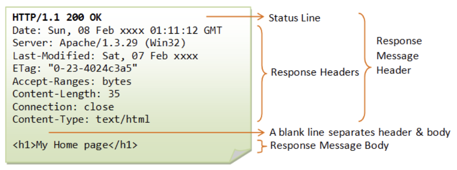

# HTTP

* [#http-0.9](http.md#http-0.9 "mention")
* [#http-0.9-1](http.md#http-0.9-1 "mention")
* [#http-1.0](http.md#http-1.0 "mention")
* [#http-1.1](http.md#http-1.1 "mention")
* [#http-2.0](http.md#http-2.0 "mention")
* [#http-3.0](http.md#http-3.0 "mention")

## HTTP란 <a href="#http-0.9" id="http-0.9"></a>

> Hyper Text Transfer Protocol으로, 인터넷에서 데이터를 주고받을 수 있는 프로토콜

웹에서 이루어지는 모든 데이터 교환의 기초로, 클라이언트-서버 프로토콜로, 수신자 측에 의해 요청이 초기화 되는 프로토콜이다.

HTTP는 애플리케이션 계층의 프로토콜로, 신뢰 가능한 전송 프로토콜이라면 이론상으로 무엇이든 사용할 수 있다. 높은 확장성으로 문서 뿐만이 아닌, 이미지, 비디오, 폼의 결과 전송등도 할 수 있다.

### 특징

#### 간단하다

사람이 읽을 수 있을 정도로 간단하게 고안되었다. 사람이 읽고 이해할 수 있어, 테스트하기 쉽고 진입장벽이 낮다.

#### 확장 가능하다

HTTP/1.0에서 등장한 HTTP 헤더 덕분에 확장하고 실험하기 쉬워졌다. 클라이언트와 서버가 헤더의 시맨틱에 대하여 합의만 된다면, 언제든 새로운 기능을 추가할 수 있다.

#### 상태가 없지만, 세션은 있다

HTTP는 상태를 저장하지 않는다(Stateless). 동일한 연결 상에 연속하여 전달된 두 요청 사이에는 연결고리가 존재하지 않는다. 하지만, 헤더 확장성을 이용하여 동일한 상태를 공유하기 위해 각각의 요청에 대한 세션을 만들도록 HTTP 쿠키를 추가하여 상태가 있는 세션을 만들도록 해준다.

## HTTP/0.9 <a href="#http-0.9" id="http-0.9"></a>

> 1991년에 나왔으며 초기에는 버전이 존재하지 없었는데 구별하기 위해 추후에 설정

### 특징

단순한 프로토콜로 요청은 단일 라인으로 구성되며 리소스에 대한 경로로 가능한 메소드는 `GET` 이 유일하다.

```http
GET /mypage.html
```

응답 또한 단순하게 파일 내용 자체로 구성된다

```html
<HTML>
About Web
</HTML>
```

특징으로는 HTTP 헤더가 없어 HTML 파일만 전송될 수 있으며, 다른 유형의 문서는 전송될 수 없다. 상태 혹은 오류 코드또한 없어 특정 HTML 파일을 사람이 처리할 수 있도록, 파일 내부에 문제에 대한 설명과 함께 응답을 실어 보냈다.

## HTTP/1.0

> 1996년에 나왔으며 브라우저와 서버가 융통성을 가지도록 확장

### 특징

* 버전 정보가 각 요청 사이로 전송되기 시작했다
* 상태코드라인이 응답의 시작에 붙어 전송되어, 브라우저가 요청에 대한 성공과 실패를 알 수 있고, 결과에 대한 처리를 할 수 있게 되었다
* HTTP 헤더 개념이 요청과 응답을 위해 도입되어, 메타데이터 전송을 허용하며 프로토콜을 유연하고 확장 가능하게 만들었다

요청의 예시

```
GET /mypage.html HTTP/1.0
User-Agent: NCSA_Mosaic/2.0 (Windows 3.1)
```

응답의 예시

```
200 OK
Date: Tue, 15 Nov 1994 08:12:31 GMT
Server: CERN/3.0 libwww/2.17
Content-Type: text/html
<HTML>
A page with an image
  
</HTML>
```

### 한계

커넥션당 하나의 요청과 하나의 응답만 처리 가능했으며, 추후에 개선된다.

## HTTP/1.1

> 1997년에 등장하여 HTTP의 첫번째 표준으로 자리잡음

### 특징

* 커넥션을 재사용 하여 시간을 절약할 수 있다
* 파이프라이닝을 추가하여, 요청에 대한 응답이 완전히 전송되기 전 두번째 요청을 전송하여 커뮤니케이션 레이턴시를 낮췄다
* [청크된 응답](https://developer.mozilla.org/ko/docs/Web/HTTP/Headers/Transfer-Encoding)이 지원된다
* 캐시 제어 메커니즘이 도입되었다
* 언어, 인코딩, 타입을 포함한 컨텐츠 협상으로, 클라이언트와 서버가 교환하려는 가장 적합한 컨텐츠에 대한 동의가 가능해졌다

요청의 예시

```
GET /en-US/docs/Glossary/Simple_header HTTP/1.1
Host: developer.mozilla.org
User-Agent: Mozilla/5.0 (Macintosh; Intel Mac OS X 10.9; rv:50.0) Gecko/20100101 Firefox/50.0
Accept: text/html,application/xhtml+xml,application/xml;q=0.9,*/*;q=0.8
Accept-Language: en-US,en;q=0.5
Accept-Encoding: gzip, deflate, br
Referer: https://developer.mozilla.org/en-US/docs/Glossary/Simple_header
```

응답의 예시

```
200 OK
Connection: Keep-Alive
Content-Encoding: gzip
Content-Type: text/html; charset=utf-8
Date: Wed, 20 Jul 2016 10:55:30 GMT
Etag: "547fa7e369ef56031dd3bff2ace9fc0832eb251a"
Keep-Alive: timeout=5, max=1000
Last-Modified: Tue, 19 Jul 2016 00:59:33 GMT
Server: Apache
Transfer-Encoding: chunked
Vary: Cookie, Accept-Encoding

(content)
```

### 한계

* HOL(Head Of Line Blocking)
  * 파이프라이닝을 통해 하나의 connection을 통해 다수의 요청/응답을 받을 수 있지만 첫 번째 응답이 지연되면, 다음의 응답들은 첫번째 응답처리가 완료되기 전까지 대기하게 되기 때문에 Head Of Line Blocking(HOLB)가 발생한다
* 연속된 요청의 헤더가 중복이 발생한다

## HTTP/2.0

> 2015년에 등장한 버전으로 HTTP/1.1 의 버전 향상에 초점을 둔 확장


HTTP/1.1이 텍스트 프로토콜에 비해 HTTP/2는 이진 프로토콜로 Stream, Message, Frame으로 구성


* Stream: 연결 내에서 전달되는 바이트의 양방향 흐름
* Message: 논리적 요청 또는 응답 메세지에 매핑되는 프레임의 시퀀스
* Frame: HTTP/2.0의 최소 단위로, 각 최소 단위에는 하나의 프라임 헤더가 존재한다.&#x20;

<figure><figcaption><p>HTTP/1.1 vs HTTP/2</p></figcaption></figure>

### 특징

#### Multiplexed Streams

* 한 연결로 동시에 여러 메세지를 받을 수 있으며, 순서에 상관없이 Stream으로 주고 받는다

#### Stream Prioritization

* 리소스간 우선순위를 설정하여 클라이언트가 필요한 리소스부터 전달

#### Server Push

* 서버는 클라이언트 요청에 대하여 요청하지 않은 리소스를 마음대로 보내줄 수 있다
* ex) 클라이언트가 HTTP만 요청했는데, CSS, JS, Image를 같이 전송

#### Header Compression

* Header Table과 Huffman Encoding을 통하여 압축
* 이전 Header의 내용과 중복되는 필드를 재전송 하지 않아 데이터를 절약

<figure><figcaption><p>Header Compression의 예</p></figcaption></figure>


## HTTP/3.0

> 전송 계층 부분에 TCP/TLS 대신 QUIC를 사용

### QUIC의 특징

> Google에서 개발한 UDP 기반의 전송 프로토콜

* 연결설정 시간 단축
* 혼잡제어 개선
* HOL없는 멀티플렉싱 지원
  * TCP의 Stream을 하나의 Chain이 아닌 독립된 Stream Chain을 구성하여 HOL Blocking 해결
* 전달 오류 수정
* 연결 마이그레이션

참고

[HTTP의 진화](https://developer.mozilla.org/ko/docs/Web/HTTP/Basics\_of\_HTTP/Evolution\_of\_HTTP)

[HTTP 개요](https://developer.mozilla.org/ko/docs/Web/HTTP/Overview)

[QUIC](https://developer.mozilla.org/ko/docs/Glossary/QUIC)

[https://hirlawldo.tistory.com/106](https://hirlawldo.tistory.com/106)


